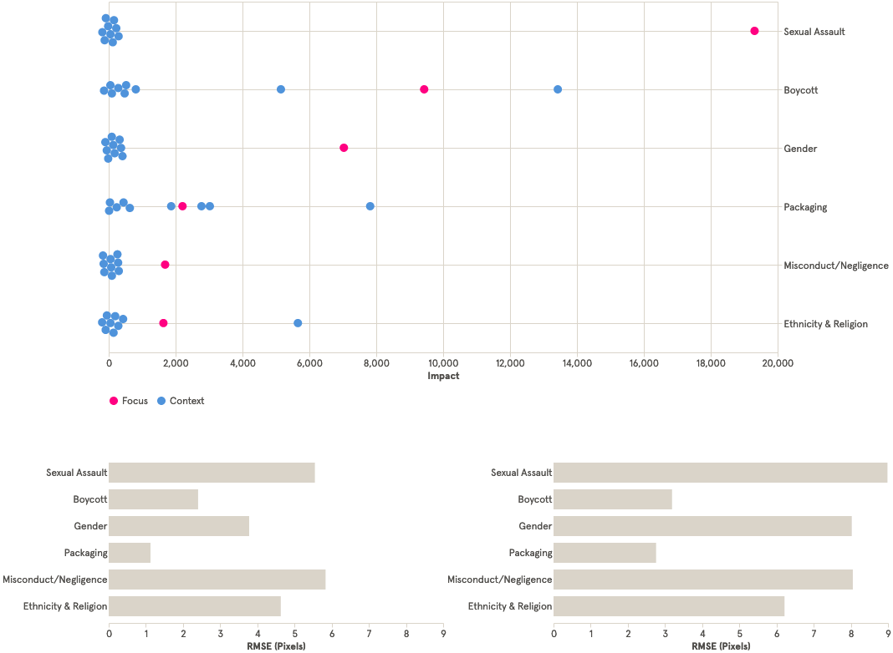

I build interactive, visual representations of data to help describe, explain, and predict patterns of human behavior.
I currently work for [Polecat][] and you can see my work in RepVault, Polecat's reputation management platform.
Below, for example, is a beeswarm plot that shows impact against topic for one focus and nine context organizations.
You can read more about it in [this notebook][1].

I have an MSc and PhD in Geographic Information Science from [City, University of London][], where I was lucky enough to be part of the [giCentre][].
After graduating, I spent a year as a research fellow in GeoInformatics at the [University of St Andrews][].
I then spent four years as a software and data engineer, working for [Verisk Maplecroft][].

[1]: https://observablehq.com/@iaindillingham/beeswarm-plots
[City, University of London]: https://www.city.ac.uk/
[Polecat]: https://www.polecat.com/
[University of St Andrews]: https://www.st-andrews.ac.uk/
[Verisk Maplecroft]: https://www.maplecroft.com/
[giCentre]: https://www.gicentre.net/
